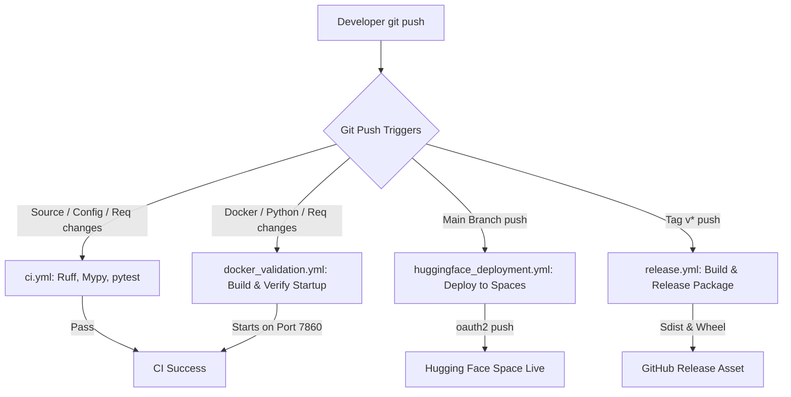

# DroneVision Deployment & Pipeline Architecture Guide

This document describes how to deploy the DroneVision application locally, using Docker, or to Hugging Face Spaces, and outlines the automated CI/CD pipeline.

---

## 1. Pipeline Architecture Diagram



---

## 2. Requirements & Dependency Separation

To prevent environment bloat and ensure that training dependencies (like DVC and MLflow) are not installed inside our runtime or Gradio environments, we have separated our dependencies into modular groups under the `requirements/` directory:

```
requirements/
├── base.txt           # Core runtime utilities (pyyaml, Pillow, scipy, tqdm)
├── runtime.txt        # Deep learning/vision engine (numpy, torch, torchvision, opencv)
├── demo.txt           # Gradio web application dependencies
├── training.txt       # Training and tracking dependencies (mlflow, dvc)
├── testing.txt        # Automated test frameworks (pytest, pytest-cov)
└── dev.txt            # Formatting, linting, auditing tools (ruff, mypy, bandit)
```

- **Local Gradio Application**: Installs only `requirements/demo.txt`.
- **Hugging Face Space**: Installs only Gradio runtime dependencies, ensuring extremely fast container startup and low memory usage.
- **Model Training**: Developer installs `requirements/training.txt` to run training and MLflow tracking.
- **Onboarding/Complete Developer Workspace**: Runs `pip install -e .[dev,api]` which installs the complete `requirements/dev.txt` profile.

---

## 3. Local Deployment

### Prerequisites
- Python 3.10+
- CUDA-capable GPU (optional, falls back to CPU automatically)
- Git & Git LFS

### Installation
1. Clone the repository and navigate to the project directory:
   ```bash
   git clone https://github.com/Shivanshu85/DroneVision.git
   cd DroneVision
   ```

2. Create and activate a virtual environment:
   ```bash
   python -m venv venv
   source venv/bin/activate  # Windows: venv\Scripts\activate
   ```

3. Install the package in editable mode with development dependencies:
   ```bash
   pip install -e .[dev,api]
   ```

### Running the Application
Launch the Gradio demo application using the root entrypoint:
```bash
python app.py
```
By default, the application will bind to `http://127.0.0.1:7860`. You can configure host and port settings using environment variables or a `.env` file (see `.env.example`).

---

## 4. Docker Deployment

Our production-ready, multi-stage `Dockerfile` incorporates advanced performance and layer-caching techniques:

### Docker Optimizations
- **BuildKit Pip Caching**: Leverages `--mount=type=cache,target=/root/.cache/pip` to preserve pip's downloaded wheels between builds, saving bandwidth and build time.
- **Layer Optimization**: Copies only the `requirements/` folder first to run pip install. Source files are copied last, preventing source changes from invalidating the heavy pip layers. Re-build times are reduced from minutes to seconds.
- **Container Security**: The container runs under a non-privileged system user (`appuser`), avoiding root-level container escalation.

### Run with Docker Compose
```bash
docker-compose up --build
```
The application will be accessible at `http://localhost:7860`.

### Manual Docker Build and Run
1. Build the image:
   ```bash
   docker build -t dronevision-demo:1.0.0 .
   ```
2. Run the container:
   ```bash
   docker run -p 7860:7860 dronevision-demo:1.0.0
   ```

---

## 5. Hugging Face Spaces Deployment

The repository includes a dedicated workflow (`huggingface_deployment.yml`) that automatically isolates and deploys only the required runtime files on pushes to the `main` branch.

### Space Layout Isolation
When deployed, the Space repository contains:
* **Gradio Entrypoint**: Root-level `app.py` wrapper.
* **Dependencies**: `requirements.txt` and `requirements/` directory.
* **System Packages**: `packages.txt` (contains `libgl1` and `libglib2.0-0` to automatically configure OpenCV's OS dependencies on Hugging Face).
* **Weights Checkpoint**: `runs/phase1/best.pth` (LFS-tracked model weights).
* **Space Metadata**: Spaces metadata block added at the top of `README.md`.
* **Source & Configuration**: `dronevision/`, `demo/`, `configs/`, `VERSION`, and `.gitattributes`.

All testing code, development tools, raw datasets, and training logs are omitted.

### Secrets Configuration
To enable automated deployments, configure a write-access token in your GitHub repository:
- Go to your repository settings: **Settings > Secrets and variables > Actions**.
- Add a new repository secret: Name = `HF_TOKEN`, Value = (your Hugging Face Access Token).

---

## 6. Automated CI/CD Pipelines

DroneVision uses optimized, concurrency-controlled workflows:

- **CI workflow (`ci.yml`)**:
  - Checks Ruff formatting, Ruff lints, `pip check` dependency resolutions, package import checks, and PyTest suites.
  - Path filters limit execution to changes in `dronevision/`, `tests/`, `configs/`, or package configurations.
- **Docker Validation (`docker_validation.yml`)**:
  - Builds the Dockerfile using caching and verifies successful startup by polling port `7860`.
- **Hugging Face Spaces Deployment (`huggingface_deployment.yml`)**:
  - Isolates runtime files and commits them to the Hugging Face Space repository using secure OAuth2 (`huggingface.co/spaces/sam9507/DroneVision`).
- **Release Automation (`release.yml`)**:
  - Triggers on tag pushes `v*` to package and build release wheel/sdist assets.
